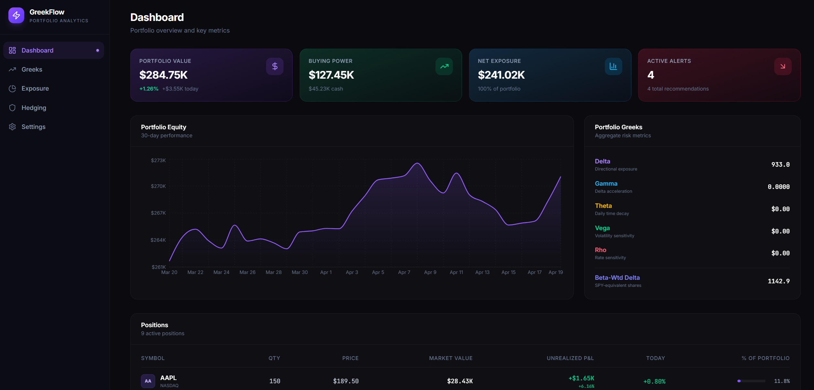
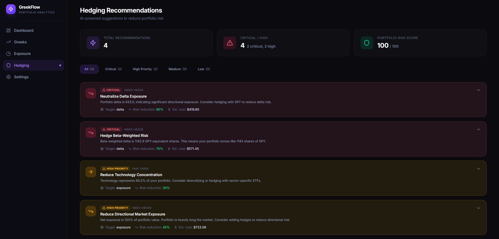
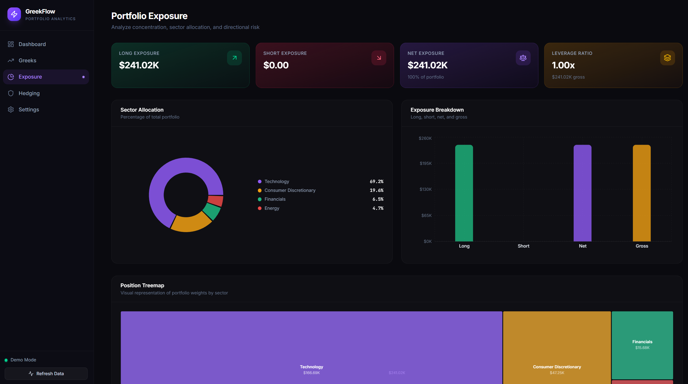

# GreekFlow - Portfolio Greeks & Hedging Dashboard

A real-time portfolio analytics and risk management dashboard for equity traders using the [Alpaca](https://alpaca.markets/) brokerage. GreekFlow computes option Greeks, analyzes portfolio exposure, and generates actionable hedging recommendations -- all from a sleek, dark-themed web interface.






## Features

### Portfolio Dashboard
- Real-time portfolio value, buying power, and daily P&L
- 30-day equity curve chart
- Positions table with weight visualization and unrealized P&L

### Greeks Analysis
- Per-position and aggregate portfolio Greeks (Delta, Gamma, Theta, Vega, Rho)
- Delta-by-position bar chart and normalized Greeks radar chart
- Beta-weighted delta analysis for market-relative risk assessment

### Exposure Analysis
- Sector allocation pie chart with concentration metrics
- Long/short/net/gross exposure breakdown
- Position treemap for visual sizing
- Detailed sector breakdown table

### Hedging Recommendations
- Algorithmic engine with 8 distinct risk checks:
  - Delta exposure & gamma risk
  - Theta decay & vega exposure
  - Sector concentration
  - Net exposure / market risk
  - Beta-weighted directional risk
  - Individual position concentration
- Recommendations sorted by urgency (critical / high / medium / low)
- Specific instruments, quantities, and estimated costs

### Settings
- Configure Alpaca API credentials at runtime
- Toggle between paper trading and live mode
- Adjust risk-free rate and auto-refresh interval

## Tech Stack

| Category | Technology |
|----------|-----------|
| Framework | [React 19](https://react.dev/) |
| Language | [TypeScript 6](https://www.typescriptlang.org/) |
| Build Tool | [Vite 8](https://vite.dev/) |
| Styling | [Tailwind CSS 4](https://tailwindcss.com/) |
| Charts | [Recharts 3](https://recharts.org/) |
| Icons | [Lucide React](https://lucide.dev/) |
| Routing | [React Router 7](https://reactrouter.com/) |

## Getting Started

### Prerequisites

- [Node.js](https://nodejs.org/) (v18 or later recommended)
- npm (included with Node.js)
- An [Alpaca](https://alpaca.markets/) account (optional -- the app includes a demo mode with mock data)

### Installation

```bash
# Clone the repository
git clone <repository-url>
cd alpaca-greeks

# Install dependencies
npm install
```

### Development

```bash
# Start the development server
npm run dev
```

The app will be available at `http://localhost:5173` (default Vite port).

### Production Build

```bash
# Type-check and build for production
npm run build

# Preview the production build locally
npm run preview
```

### Linting

```bash
npm run lint
```

## Configuration

### Demo Mode (Default)

GreekFlow launches in **demo mode** by default, using mock portfolio data (~9 positions, ~$285K portfolio). No API credentials are required to explore the full feature set.

### Connecting to Alpaca

To use live portfolio data:

1. Navigate to the **Settings** page via the sidebar
2. Enter your **Alpaca API Key** and **Secret Key**
3. Toggle **Paper Trading** on or off (paper trading is recommended for testing)
4. Click **Save & Connect**

API credentials are stored in-memory only and are not persisted to disk or `localStorage`.

### Configuration Options

| Setting | Default | Description |
|---------|---------|-------------|
| API Key | *(empty)* | Alpaca API Key ID |
| Secret Key | *(empty)* | Alpaca API Secret Key |
| Paper Trading | `true` | Use paper trading API vs. live |
| Risk-Free Rate | `0.05` (5%) | Risk-free rate for Black-Scholes calculations |
| Refresh Interval | `30s` | Auto-refresh interval for portfolio data |

## Architecture

### Project Structure

```
src/
├── components/
│   ├── layout/
│   │   ├── Layout.tsx          # Shell layout with sidebar + content area
│   │   └── Sidebar.tsx         # Navigation sidebar with connection status
│   └── ui/
│       ├── GlassCard.tsx       # Reusable glassmorphism card component
│       └── MetricCard.tsx      # KPI metric display card
├── context/
│   └── PortfolioContext.tsx     # Central state management (React Context)
├── pages/
│   ├── Dashboard.tsx           # Portfolio overview
│   ├── GreeksPage.tsx          # Greeks analysis & visualization
│   ├── ExposurePage.tsx        # Sector/directional exposure
│   ├── HedgingPage.tsx         # Hedge recommendation engine UI
│   └── SettingsPage.tsx        # API credentials & parameters
├── services/
│   └── alpacaApi.ts            # Alpaca REST API client
├── types/
│   └── index.ts                # TypeScript type definitions
├── utils/
│   ├── blackScholes.ts         # Black-Scholes pricing & Greeks engine
│   ├── exposure.ts             # Portfolio exposure & sector calculations
│   ├── formatters.ts           # Display formatting utilities
│   ├── hedging.ts              # Hedge recommendation algorithm
│   └── mockData.ts             # Mock portfolio data generator
├── App.tsx                     # Root component with routing
├── main.tsx                    # Application entry point
└── index.css                   # Global styles (Tailwind + glassmorphism)
```

### Key Modules

#### Black-Scholes Engine (`src/utils/blackScholes.ts`)
Full implementation of the Black-Scholes option pricing model:
- Standard normal CDF/PDF computation
- d1/d2 parameter calculation
- Call and put option pricing
- All five Greeks: Delta, Gamma, Theta, Vega, Rho
- Implied volatility via Newton-Raphson iteration
- Historical volatility from price series

#### Exposure Calculator (`src/utils/exposure.ts`)
- Sector mapping for ~50 common tickers
- Beta estimates for ~30 tickers
- Portfolio exposure aggregation (long/short/net/gross)
- Sector-level breakdown with allocation percentages
- Beta-weighted delta computation

#### Hedging Engine (`src/utils/hedging.ts`)
Runs 8 independent risk checks against configurable thresholds and generates prioritized hedge recommendations with specific trade suggestions (instruments, quantities, estimated costs).

#### State Management (`src/context/PortfolioContext.tsx`)
A React Context provider that centralizes all application state:
- Account data and positions (live or mock)
- Computed Greeks, exposure, and hedging data
- API configuration and connection status
- Auto-refresh timer management

### API Integration

GreekFlow connects to two Alpaca API endpoints, proxied through Vite's dev server to avoid CORS issues:

| API | Base URL | Proxy Path |
|-----|----------|------------|
| Trading (Paper) | `https://paper-api.alpaca.markets` | `/api/alpaca/*` |
| Market Data | `https://data.alpaca.markets` | `/api/alpaca-data/*` |

**Endpoints used:**

| Function | Method | Path | Description |
|----------|--------|------|-------------|
| `getAccount()` | GET | `/v2/account` | Account details (equity, buying power, etc.) |
| `getPositions()` | GET | `/v2/positions` | All open positions |
| `getPosition(symbol)` | GET | `/v2/positions/{symbol}` | Single position |
| `getPortfolioHistory()` | GET | `/v2/account/portfolio/history` | Historical equity curve |
| `getSnapshot(symbol)` | GET | `/v2/stocks/{symbol}/snapshot` | Latest market data |
| `getSnapshots(symbols)` | GET | `/v2/stocks/snapshots` | Batch market data |
| `getHistoricalBars(symbol)` | GET | `/v2/stocks/{symbol}/bars` | Historical OHLCV bars |

Authentication uses `APCA-API-KEY-ID` and `APCA-API-SECRET-KEY` headers.

## Routes

| Path | Page | Description |
|------|------|-------------|
| `/` | Dashboard | Portfolio overview with KPIs and equity chart |
| `/greeks` | Greeks | Per-position and aggregate Greeks analysis |
| `/exposure` | Exposure | Sector allocation and directional exposure |
| `/hedging` | Hedging | Algorithmic hedge recommendations |
| `/settings` | Settings | API configuration and app parameters |

## Design

The UI features a dark theme with glassmorphism effects, glow accents, and smooth animations. Typography uses **Inter** for UI text and **JetBrains Mono** for numerical/financial data (loaded via Google Fonts CDN).

## Scripts Reference

| Command | Description |
|---------|-------------|
| `npm run dev` | Start Vite dev server with HMR and API proxying |
| `npm run build` | Type-check with `tsc` then build with Vite |
| `npm run preview` | Serve the production build locally |
| `npm run lint` | Run ESLint across the project |

## License

This project is private and not published to npm.
